# 🏗️ **HyperKit AI Agent - Architecture Diagrams**

**Prepared by**: Justine (CPOO)  
**Date**: October 23, 2025  
**Version**: 1.0.0  

---

## 📋 **SYSTEM OVERVIEW**

The HyperKit AI Agent is a comprehensive smart contract generation and deployment platform built with modern microservices architecture.

---

## 🎯 **HIGH-LEVEL ARCHITECTURE**

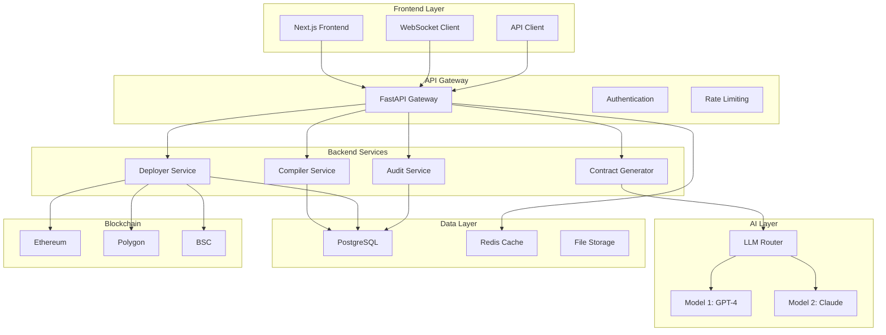

---

## 🔄 **REQUEST FLOW DIAGRAM**

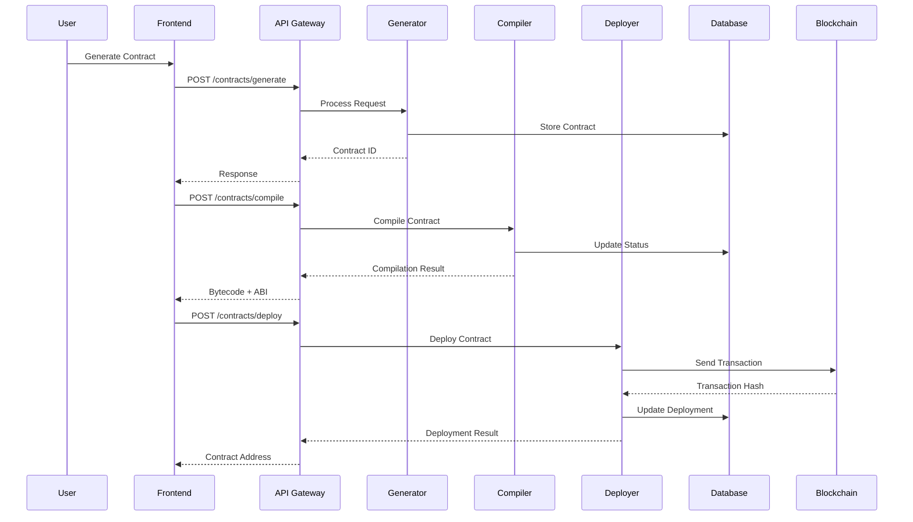

---

## 🗄️ **DATABASE SCHEMA**

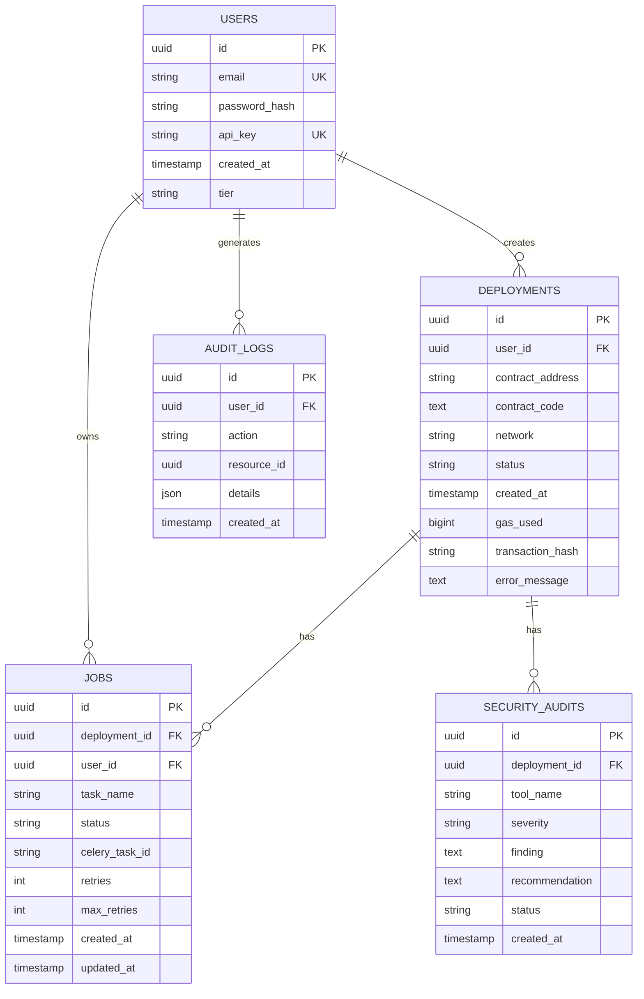

---

## 🔧 **MICROSERVICES ARCHITECTURE**

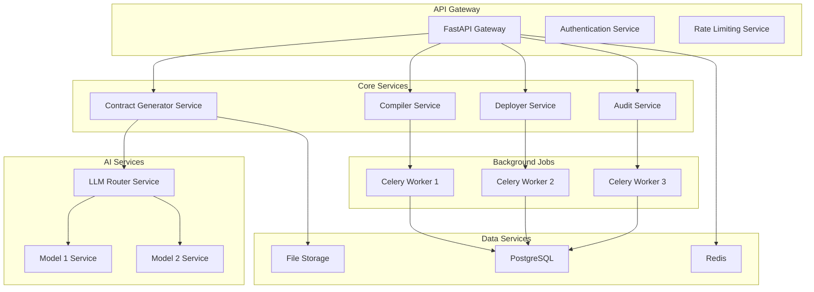

---

## 🌐 **DEPLOYMENT ARCHITECTURE**

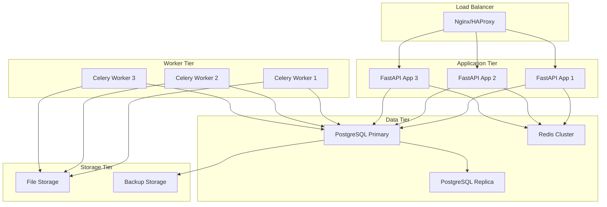

---

## 🔐 **SECURITY ARCHITECTURE**

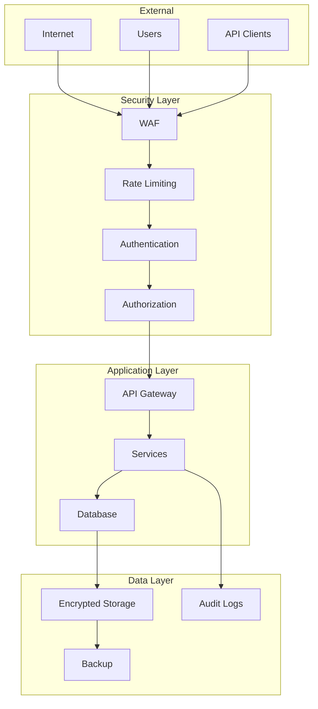

---

## 📊 **MONITORING ARCHITECTURE**

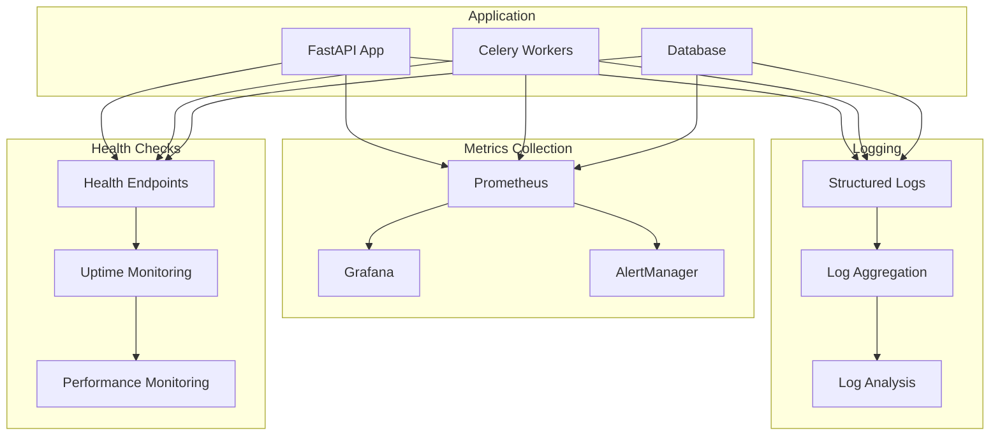

---

## 🔄 **ASYNC PROCESSING FLOW**

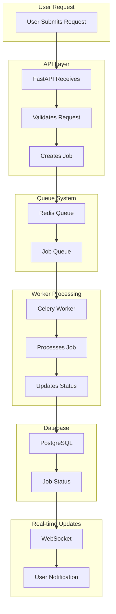

---

## 🌍 **NETWORK TOPOLOGY**

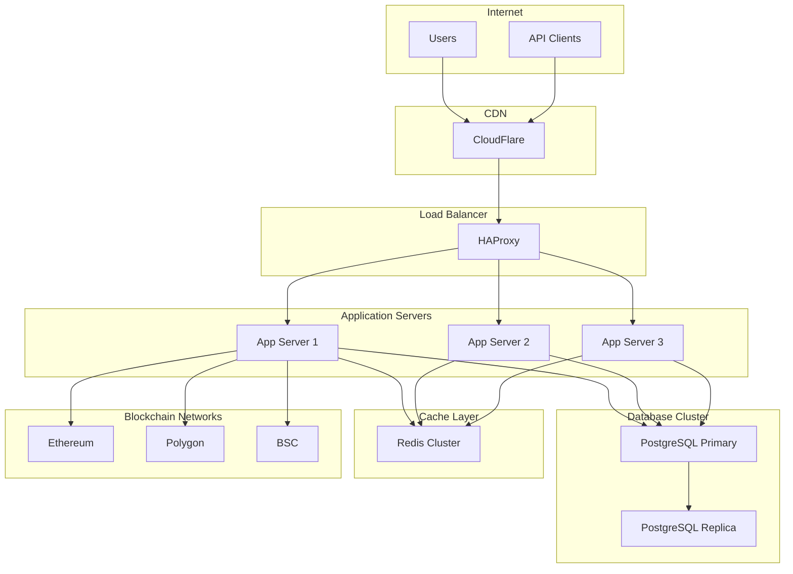

---

## 📈 **SCALABILITY ARCHITECTURE**

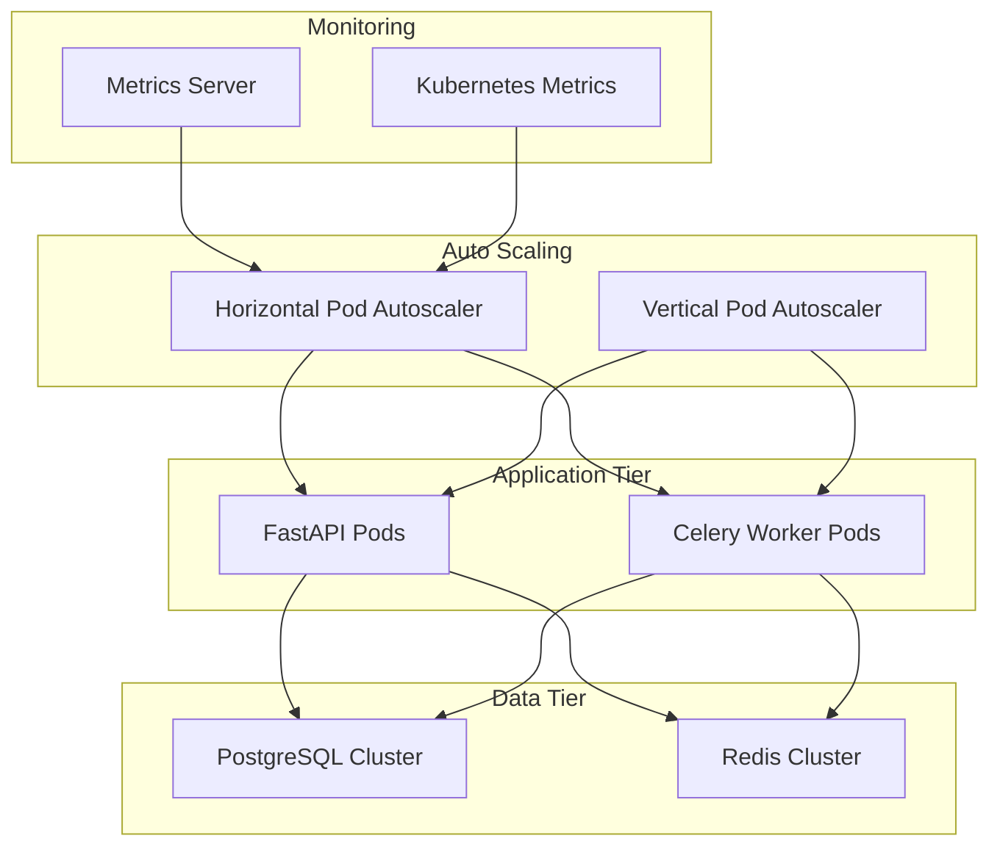

---

## 🔧 **DEVELOPMENT ARCHITECTURE**

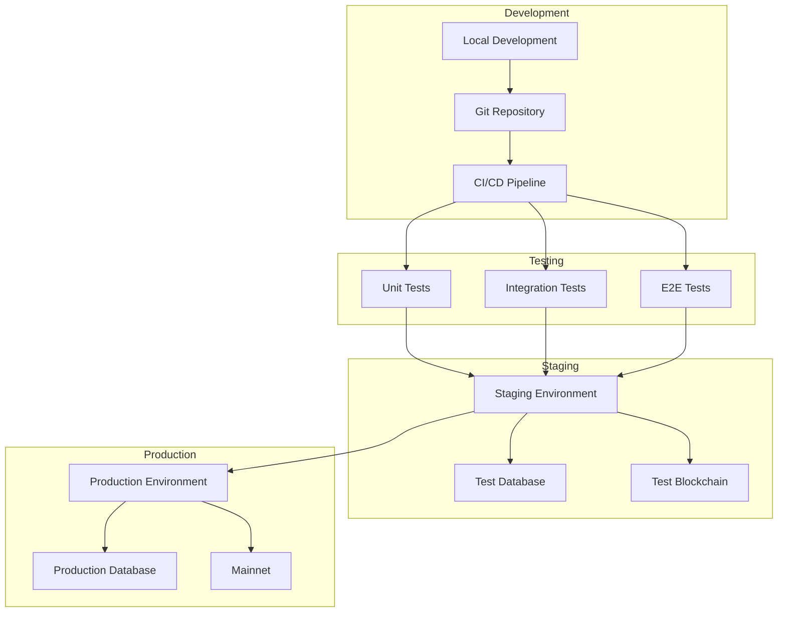

---

## 📋 **COMPONENT RESPONSIBILITIES**

### **Frontend (Next.js + CSS)**
- User interface and experience
- Real-time updates via WebSocket
- Form validation and error handling
- Responsive design for all devices

### **API Gateway (FastAPI)**
- Request routing and validation
- Authentication and authorization
- Rate limiting and security
- Response formatting

### **Backend Services**
- **Contract Generator**: AI-powered contract creation
- **Compiler Service**: Solidity compilation with Foundry
- **Deployer Service**: Multi-chain deployment
- **Audit Service**: Security analysis and reporting

### **AI Layer**
- **LLM Router**: Model selection and routing
- **Model Services**: GPT-4, Claude, and other LLMs
- **Prompt Engineering**: Optimized prompts for contract generation

### **Data Layer**
- **PostgreSQL**: Primary database for all data
- **Redis**: Caching and session management
- **File Storage**: Contract source code and artifacts

### **Background Processing**
- **Celery Workers**: Async job processing
- **Job Queues**: Task distribution and management
- **Retry Logic**: Automatic retry for failed jobs

---

## 🎯 **INTEGRATION POINTS**

### **Aaron (CTO) - Backend Integration**
- Database schema and migrations
- API endpoint implementation
- Celery task configuration
- Security and authentication

### **Tristan (CMFO) - Frontend Integration**
- Next.js component development
- WebSocket integration
- API client implementation
- UI/UX design and styling

### **Justine (CPOO) - Product Integration**
- End-to-end testing
- Documentation and guides
- Team coordination
- Quality assurance

---

*Architecture Diagrams v1.0.0 - Prepared by Justine (CPOO) - October 23, 2025*
