<!-- AUDIT_BADGE_START -->
**Implementation Status**: ✅ Verified  
**Version**: 1.5.7  
**Last Verified**: 2025-10-29  
**Commit**: `aac4687`  
**Branch**: `main`  
<!-- AUDIT_BADGE_END -->

# HyperKit AI Agent - Architecture Diagrams

**Version**: 1.5.7  
**Last Updated**: October 27, 2025

## Table of Contents

1. [System Overview](#system-overview)
2. [Service Architecture](#service-architecture)
3. [Data Flow Diagrams](#data-flow-diagrams)
4. [Security Architecture](#security-architecture)
5. [Deployment Architecture](#deployment-architecture)
6. [API Architecture](#api-architecture)

---

## System Overview

### High-Level System Architecture

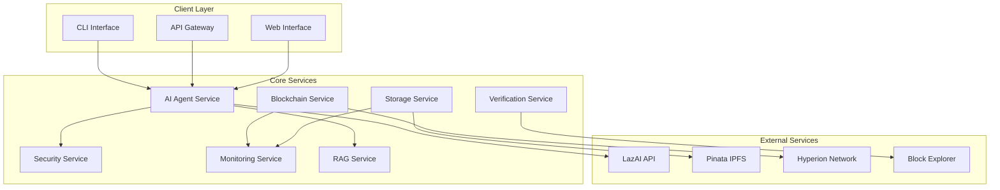

### Component Interaction Flow

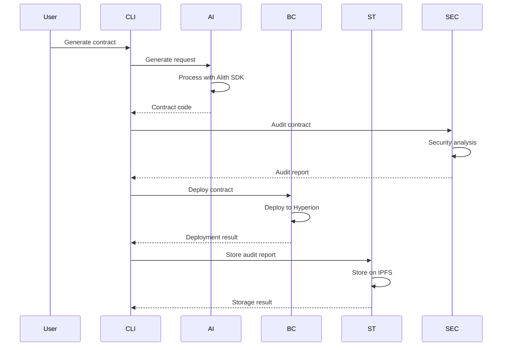

---

## Service Architecture

### Core Services Detailed View

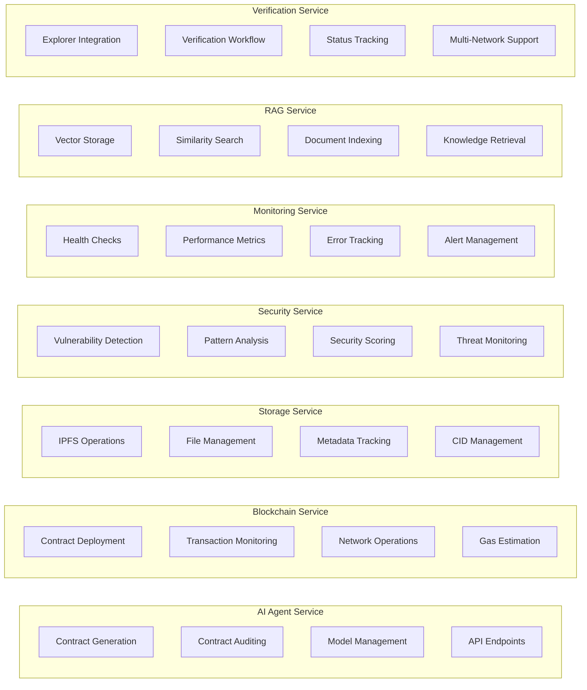

### Service Dependencies

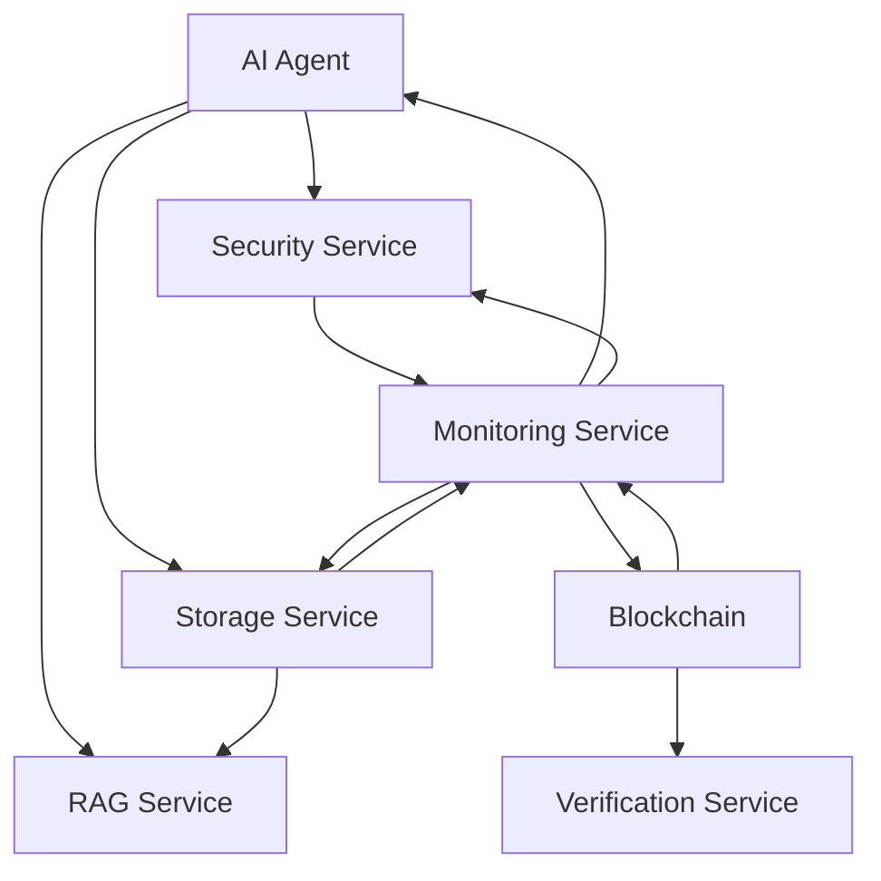

---

## Data Flow Diagrams

### Contract Generation Flow

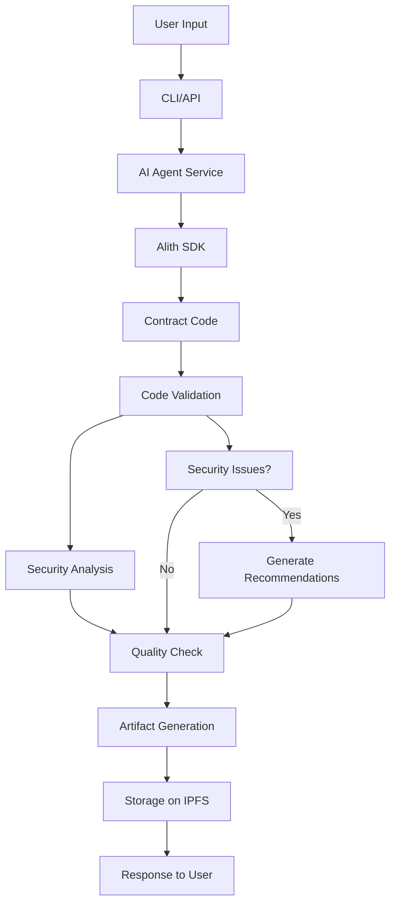

### Contract Auditing Flow

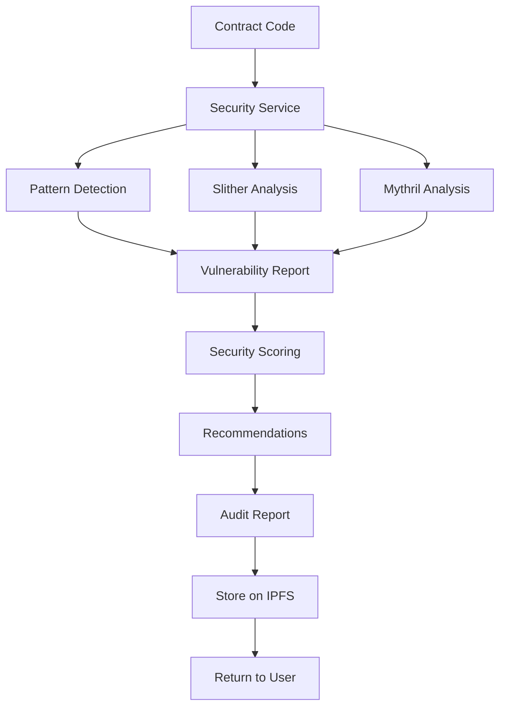

### Deployment Flow

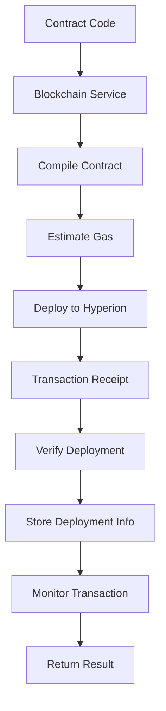

---

## Security Architecture

### Security Layers

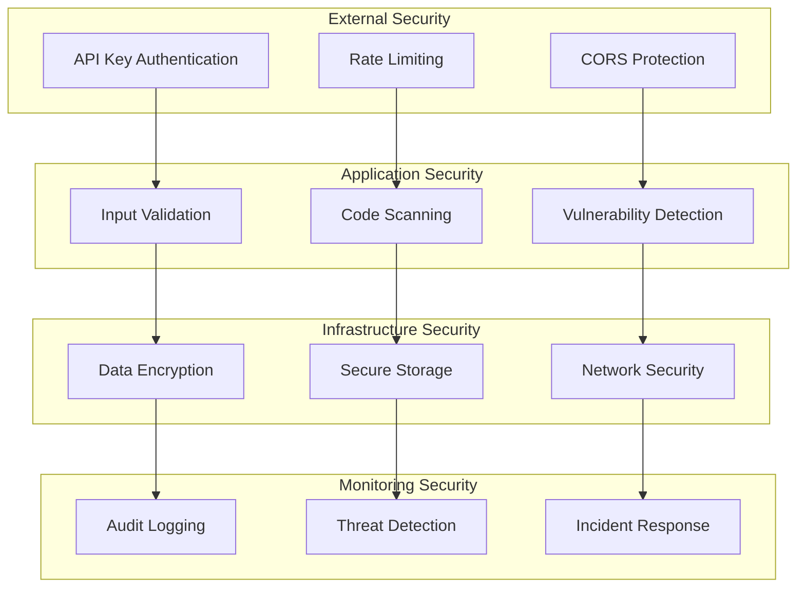

### Security Scanning Pipeline

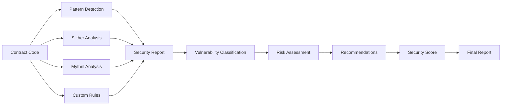

---

## Deployment Architecture

### Production Deployment

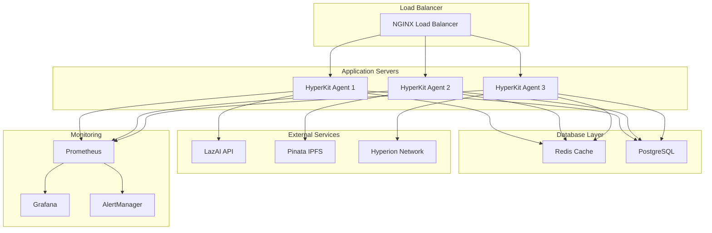

### Docker Container Architecture

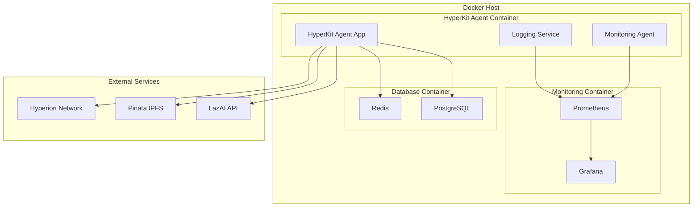

---

## API Architecture

### REST API Structure

```mermaid
graph TB
    subgraph "API Gateway"
        GATEWAY[NGINX Gateway]
    end
    
    subgraph "API Routes"
        V1[/api/v1]
        V2[/api/v2]
    end
    
    subgraph "Service Endpoints"
        AI_ENDPOINTS[AI Agent Endpoints]
        BC_ENDPOINTS[Blockchain Endpoints]
        ST_ENDPOINTS[Storage Endpoints]
        SEC_ENDPOINTS[Security Endpoints]
        MON_ENDPOINTS[Monitoring Endpoints]
        RAG_ENDPOINTS[RAG Endpoints]
        VER_ENDPOINTS[Verification Endpoints]
    end
    
    subgraph "Middleware"
        AUTH[Authentication]
        RATE[Rate Limiting]
        LOG[Logging]
        VAL[Validation]
    end
    
    GATEWAY --> V1
    GATEWAY --> V2
    
    V1 --> AUTH
    V2 --> AUTH
    
    AUTH --> RATE
    RATE --> LOG
    LOG --> VAL
    
    VAL --> AI_ENDPOINTS
    VAL --> BC_ENDPOINTS
    VAL --> ST_ENDPOINTS
    VAL --> SEC_ENDPOINTS
    VAL --> MON_ENDPOINTS
    VAL --> RAG_ENDPOINTS
    VAL --> VER_ENDPOINTS
```

### WebSocket Architecture

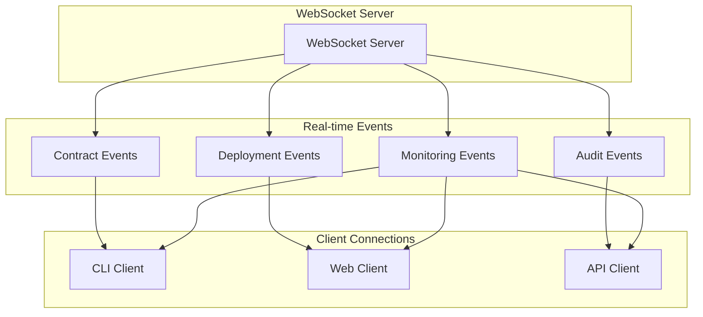

---

## Sample Integration Scripts

### Python Integration Example

```python
# hyperkit_integration.py
import asyncio
from hyperkit_agent import HyperKitClient

async def main():
    # Initialize client
    client = HyperKitClient(
        api_key="your_api_key",
        base_url="https://api.hyperkit.ai"
    )
    
    # Generate contract
    print("Generating contract...")
    contract = await client.generate_contract({
        "name": "MyToken",
        "type": "ERC20",
        "features": ["mintable", "burnable", "pausable"],
        "security": "high"
    })
    
    print(f"Contract generated: {contract.name}")
    print(f"Security score: {contract.security_score}")
    
    # Audit contract
    print("Auditing contract...")
    audit = await client.audit_contract(contract.code)
    
    print(f"Audit completed: {audit.security_score}/100")
    if audit.vulnerabilities:
        print("Vulnerabilities found:")
        for vuln in audit.vulnerabilities:
            print(f"  - {vuln.type}: {vuln.description}")
    
    # Deploy contract
    print("Deploying contract...")
    deployment = await client.deploy_contract(
        contract.code,
        constructor_args=["MyToken", "MTK", 1000000]
    )
    
    print(f"Contract deployed at: {deployment.address}")
    print(f"Transaction hash: {deployment.tx_hash}")
    
    # Store audit report
    print("Storing audit report...")
    storage = await client.store_audit_report(audit)
    
    print(f"Audit report stored: {storage.cid}")
    print(f"IPFS URL: {storage.url}")

if __name__ == "__main__":
    asyncio.run(main())
```

### JavaScript Integration Example

```javascript
// hyperkit_integration.js
const { HyperKitClient } = require('@hyperkit/agent-sdk');

async function main() {
    // Initialize client
    const client = new HyperKitClient({
        apiKey: 'your_api_key',
        baseUrl: 'https://api.hyperkit.ai'
    });
    
    try {
        // Generate contract
        console.log('Generating contract...');
        const contract = await client.generateContract({
            name: 'MyToken',
            type: 'ERC20',
            features: ['mintable', 'burnable', 'pausable'],
            security: 'high'
        });
        
        console.log(`Contract generated: ${contract.name}`);
        console.log(`Security score: ${contract.securityScore}`);
        
        // Audit contract
        console.log('Auditing contract...');
        const audit = await client.auditContract(contract.code);
        
        console.log(`Audit completed: ${audit.securityScore}/100`);
        if (audit.vulnerabilities.length > 0) {
            console.log('Vulnerabilities found:');
            audit.vulnerabilities.forEach(vuln => {
                console.log(`  - ${vuln.type}: ${vuln.description}`);
            });
        }
        
        // Deploy contract
        console.log('Deploying contract...');
        const deployment = await client.deployContract(
            contract.code,
            ['MyToken', 'MTK', 1000000]
        );
        
        console.log(`Contract deployed at: ${deployment.address}`);
        console.log(`Transaction hash: ${deployment.txHash}`);
        
        // Store audit report
        console.log('Storing audit report...');
        const storage = await client.storeAuditReport(audit);
        
        console.log(`Audit report stored: ${storage.cid}`);
        console.log(`IPFS URL: ${storage.url}`);
        
    } catch (error) {
        console.error('Error:', error.message);
    }
}

main();
```

### CLI Usage Examples

```bash
# Generate a contract
./hyperagent generate \
  --requirements "ERC20 token with mint and burn functions" \
  --output my_token.sol

# Audit a contract
./hyperagent audit \
  --contract-file my_token.sol \
  --security-level high \
  --output audit_report.json

# Deploy a contract
./hyperagent deploy \
  --contract-file my_token.sol \
  --network hyperion \
  --args "MyToken,MTK,1000000"

# Verify a contract
./hyperagent verify \
  --address 0x1234567890123456789012345678901234567890 \
  --source-file my_token.sol \
  --compiler-version 1.4.8

# Monitor system health
./hyperagent monitor --health --metrics --transactions
```

---

*Last Updated: October 27, 2025*
